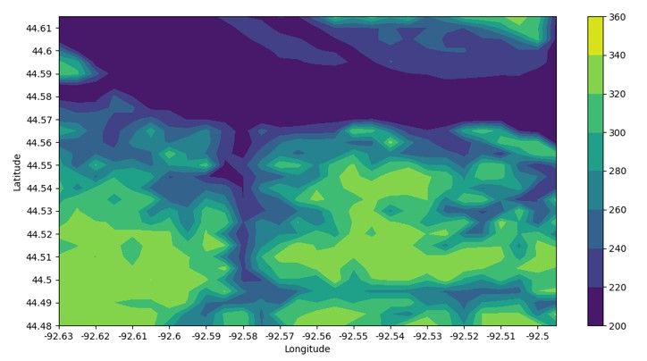
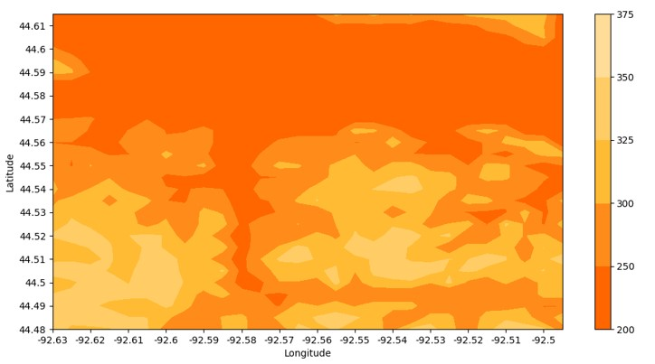
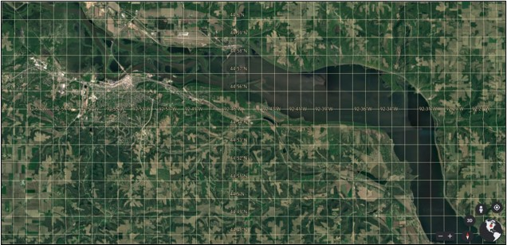

# TopMap #

## Overview ##

* Created a contour map of Red Wing, MN, using Google Maps Elevation data 
* Calculated quarter-mile intervals, retrived elevation data, and plotted contour lines
* Estimated total cubic volume above "river level" (at or above the Mississippi)

 

## Point Generation ##

I generated a 28 by 28 square grid of evenly-spaced quarter statute mile bins, which I would use to retrieve the given elevation levels. 

Because the earth is an [oblate spheroid](https://en.wikipedia.org/wiki/Spheroid#Oblate_spheroids), it is important to consider how the longitude changes with respect to the latitude. Each degree of longitude along the equator represents about 111 km/69 mi, but this interval decreases as one moves north or south.

The distance per degree of longitude approaches zero as one approaches the poles. If an igloo was constructed on the very northmost point of the north pole, a short walk around the perimeter would result in traveling nearly 360 degrees longitude in only a couple of feet!

For this reason, I needed to measure the distance between meridians of lognitude along the same latitude. I utilized the following equation for finding the change in distance and the change in longitude: 

The derivations are rather complicated, but the final result is a simple equation for finding the distance between two points along the same meridian. Astro Navigation Demystifyed has a great [article](https://astronavigationdemystified.com/measuring-the-distance-between-meridians-of-longitude-along-a-parallel-of-latitude/) breaking it down.

 

## Data Collection & Preparation ##

With the 784 points that I generated, I pulled elevation data from the Google Maps Elevation API. With all of the data I needed, the only thing left to do was to properly format the data. 

The contour function in Matplotlib neccessitates that the X and Y values are the same shape as the Z, and that the Z values over which the contour lines are drawn be an N by M array. My data was essentially an XYZ table, so I needed to represent my elevation data as a function of the latitude and longitude.

 

## Results ##
***

    

    

***

